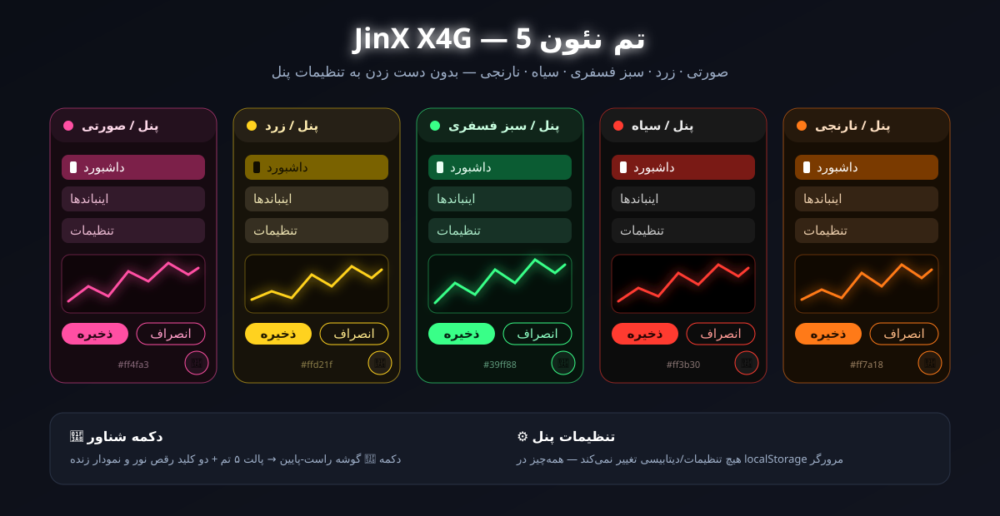
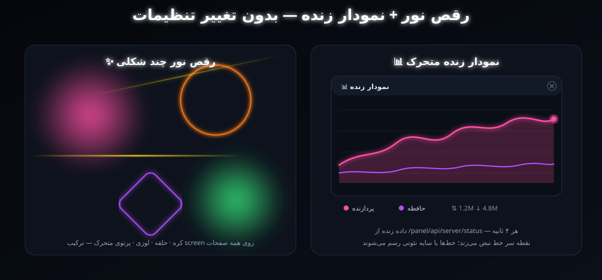

<div align="center">


<br>

<a href="https://t.me/Super_Jinx"></a>
<a href="https://railway.com"></a>
<a href="https://github.com/MHSanaei/3x-ui/releases/tag/v2.9.4"></a>
<a href="https://github.com/XTLS/Xray-core"></a>
<a href="LICENSE"></a>

<br><br>


<br><br>


</div>

<div dir="rtl">


## 𝗝𝗶𝗻𝗫 𝗫𝟰𝗚 چیست؟

**𝗝𝗶𝗻𝗫 𝗫𝟰𝗚** نسخه‌ی اختصاصی پنل محبوب **3X-UI** است که از صفر برای **Railway** ساخته شده؛ حاصل **همکاری رسمی جینکس و آقای ایکس فورجی**.

فقط فایل‌ها را در گیت‌هاب بگذار و دیپلوی را بزن. پنل، کانفیگ قفل‌شده، ساب‌لینک اختصاصی و **۱۴ ربات نگهبان** خودشان آماده می‌شوند. نه دستوری لازم است، نه سروری، نه تنظیم دستی.

> **یک دیپلوی. یک پنل. صفر دردسر.**


<div align="center">

</div>


## ساب‌لینکی که کاربر عاشقش می‌شود

صفحه‌ی اشتراک اختصاصی با طراحی همکاری جینکس و ایکس فورجی؛ بدون هیچ تنظیمی، از همان لحظه‌ی اول روی پنل فعال است.

<div align="center">

</div>

<br>

| | |
|:---|:---|
| **۵ زبان** | فارسی، English، Русский، 中文، Türkçe با پرچم، درست مثل نسخه‌ی اصلی |
| **سه حالت نمایش** | روشن، تیره و خیلی تیره (مشکی کامل برای صفحه‌های OLED) |
| **QR درخشان** | دو دنباله‌دار سبز و طلایی دور هر QR؛ با یک لمس کپی می‌شود |
| **نصب یک‌کلیکی** | دکمه‌های مستقیم v2rayNG، Hiddify، Streisand، V2Box، Happ و برنامه‌های دیگر |
| **مصرف زنده** | حجم مصرفی، باقی‌مانده، تاریخ انقضا و وضعیت اشتراک |
| **گوشی و کامپیوتر** | دستگاه را تشخیص می‌دهد و نمای مخصوص همان را نشان می‌دهد |

## تم‌ها، رقص نور و نمودار زنده (نسخه فورک)

**بدون دست زدن به هیچ تنظیماتی** — همه‌چیز از یک دکمه‌ی شناور 🎨 گوشه‌ی راست-پایین کنترل می‌شود و انتخاب‌ها فقط در حافظه‌ی مرورگر (`localStorage`) ذخیره می‌شوند.

<div align="center">

</div>

| تم | رنگ اصلی | حس و حال |
|:---|:---|:---|
| 🩷 **صورتی** | `#ff4fa3` | گرم و فانتزی |
| 💛 **زرد** | `#ffd21f` | روشن و پرانرژی |
| 💚 **سبز فسفری** | `#39ff88` | نئون و مدرن |
| 🖤 **سیاه** | `#ff3b30` قرمز روی مشکی خالص | تیره‌ی واقعی، دوستدار OLED |
| 🧡 **نارنجی** | `#ff7a18` | آتشین و جذاب |

<div align="center">

</div>

| قابلیت | توضیح |
|:---|:---|
| ✨ **رقص نور چند شکلی** | ۲ کره‌ی نورانی + ۱ حلقه‌ی نئون + ۱ لوزی + ۲ پرتوی متحرک با مسیر و سرعت متفاوت، روی همه‌ی صفحات (حتی صفحه‌ی ورود) و با رنگ هر تم |
| 📊 **نمودار زنده متحرک** | دو خط صاف (پردازنده + حافظه) با سایه‌ی نئونی و نقطه‌ی سرخط نبض‌زن؛ داده‌ی واقعی هر ۴ ثانیه از همان API پنل (`/panel/api/server/status`) + نمایش آپلود/دانلود لحظه‌ای |
| 🌐 **۵ زبانه** | برچسب‌های دکمه و نمودار با زبان خود پنل (فارسی، English، Русский، 中文، Türkçe) عوض می‌شوند |
| 📱 **موبایل‌دوست** | نمودار روی گوشی کوچک‌تر می‌شود؛ همه‌چیز با GPU (`transform` + `contain`) روان اجرا می‌شود |

> برای فعال شدن، کافیست سرویس Railway به همین فورک وصل باشد. هیچ متغیر محیطی یا تنظیمی لازم نیست.


## راز سرعت

<div align="center">

</div>

<br>

هر کانفیگی که از ساب بیرون می‌آید، خودکار تقویت می‌شود:

| تقویت | اثر |
|:---|:---|
| **اثر انگشت Chrome** | اتصال برای فیلترینگ مثل یک مرورگر معمولی دیده می‌شود؛ سرعت ثابت روی همراه اول، ایرانسل و مخابرات |
| **ارسال زودهنگام** | اولین درخواست همراه خود اتصال می‌رود؛ یک رفت‌وبرگشت کمتر، پینگ پایین‌تر |
| **QUIC بسته** | برنامه‌ها مستقیم سراغ اتصال پایدار می‌روند؛ پینگ بالا و پایین نمی‌پرد |
| **DNS سریع و IPv4** | جواب DNS از 1.1.1.1 و 8.8.8.8؛ بدون گیر کردن روی IPv6 |
| **بدون بافر اضافه** | بسته‌ها بدون مکث از nginx به Xray می‌رسند |
| **اتصال همیشه زنده** | ضربان منظم WebSocket نمی‌گذارد اتصال بخوابد |


<div align="center">

</div>

<br>

هر چهار لوکیشن Railway پشتیبانی می‌شوند و هر کدام مستقل کار می‌کنند. روی **آمستردام (هلند)** پروفایل **توربو** خودکار روشن می‌شود: بافرهای بزرگ‌تر و نگه‌داشت سریع‌تر اتصال.


## ۱۴ ربات نگهبان

یک نگهبان همیشه بیدار که هر چند ثانیه همه‌چیز را چک می‌کند و هر خرابی را **خودش** تعمیر می‌کند:

| ربات | مراقب چیست | اگر خراب شود |
|:---|:---|:---|
| پنل | باز بودن پنل | ری‌استارت پنل |
| ساب | سرور ساب‌لینک | ری‌استارت پنل |
| Xray | پورت کانفیگ | ری‌استارت هسته‌ی Xray |
| nginx | پورت 8080 | ری‌استارت nginx |
| فایل‌های پنل | رسیدن کامل فایل‌ها به مرورگر | ترمیم و ری‌استارت nginx |
| مسیر ورود | رفتن دامنه به صفحه‌ی ورود | بازسازی تنظیمات |
| سرویس کمکی | QR و سلامت سرویس | ری‌استارت سرویس |
| اینباند | وجود و سالم بودن اینباند قفل‌شده | بازگردانی، با حفظ کاربرها |
| تنظیمات | تنظیمات حیاتی پنل و ساب | بازنویسی تنظیمات |
| سرعت | DNS، IPv4، QUIC و زمان‌بندی‌ها | اعمال دوباره و ری‌استارت Xray |
| دامنه | دامنه‌ی عمومی سرویس | به‌روزرسانی لینک‌ها |
| دیتابیس | سلامت و نسخه‌ی پشتیبان | بازگردانی آخرین نسخه‌ی سالم |
| تونل | اتصال واقعی WebSocket، دقیقا مثل گوشی کاربر | ری‌استارت همان بخشی که مقصر است |
| رم | مصرف حافظه با کاربرهای هم‌زمان | ری‌استارت آرام Xray قبل از پر شدن رم |


<div align="center">

</div>

## نصب روی Railway

<details open>
<summary><b>قدم ۱: آپلود در گیت‌هاب</b></summary>

<br>

یک ریپوی جدید بساز و **همه‌ی فایل‌ها را یکجا** در صفحه‌ی اول ریپو آپلود کن. فایل `Dockerfile` باید در همان صفحه‌ی اول باشد، نه داخل پوشه.

</details>

<details open>
<summary><b>قدم ۲: دیپلوی در Railway</b></summary>

<br>

در Railway گزینه‌ی **New Project** و بعد **Deploy from GitHub repo** را بزن و همین ریپو را انتخاب کن.

</details>

<details open>
<summary><b>قدم ۳: Volume و دامنه</b></summary>

<br>

یک **Volume** با مسیر زیر بساز تا اطلاعات پنل با هر دیپلوی پاک نشود:

```
/etc/x-ui
```

بعد در **Networking** گزینه‌ی **Generate Domain** را بزن و پورت را `8080` بگذار. لوکیشن را هم از **Settings › Regions** انتخاب کن.

</details>

<details open>
<summary><b>قدم ۴: ورود به پنل</b></summary>

<br>

دامنه را **خالی** باز کن؛ مستقیم به صفحه‌ی ورود می‌رود.

| نام کاربری | رمز عبور |
|:---:|:---:|
| `admin` | `admin` |

> **توصیه‌ی امنیتی:** بعد از اولین ورود، رمز عبور را از تنظیمات پنل عوض کن.

</details>


## ابزارهای بررسی سلامت

این آدرس‌ها را **جلوی دامنه‌ی خودت** باز کن:

| آدرس | کاربرد |
|:---|:---|
| `/jx-status` | وضعیت همه‌ی بخش‌ها، زمان تونل و اینترنت و مصرف رم |
| `/jx-status?deep=1` | تست کامل صفحه‌ی پنل و فایل‌هایش |
| `/jx-check` | تست پنل داخل مرورگر خودت، فایل به فایل |


## متغیرهای اختیاری

هیچ متغیری لازم نیست؛ این‌ها فقط برای شخصی‌سازی‌اند.

| متغیر | کاربرد | پیش‌فرض |
|:---|:---|:---:|
| `JX_PANEL_PATH` | آدرس دلخواه پنل (مثلا `/my-panel/`) | تصادفی |
| `JX_ADMIN_USER` / `JX_ADMIN_PASS` | نام کاربری و رمز، فقط در اولین اجرا | `admin` / `admin` |
| `JX_DOMAIN` | دامنه‌ی اختصاصی به جای دامنه‌ی Railway | خودکار |
| `JX_TURBO` | `on` یا `off` برای پروفایل توربو | `auto` (فقط هلند) |
| `JX_LINK_TUNE` | `off` برای خاموش کردن تقویت لینک‌ها | `on` |
| `JX_IPV6` | `off` برای خاموش کردن IPv6 | `auto` |

<details>
<summary><b>ساختار پروژه</b></summary>

<br>

| فایل | کاربرد |
|:---|:---|
| `Dockerfile` | ساخت ایمیج بر پایه‌ی 3X-UI v2.9.4 |
| `railway.json` | تنظیمات دیپلوی Railway |
| `bootstrap.py` | راه‌اندازی خودکار پنل، ساب‌لینک و اینباند |
| `guard.py` | ۱۴ ربات نگهبان |
| `helper.py` | سلامت سرویس، QR و تقویت ساب |
| `linktune.py` | تقویت سرعت کانفیگ‌ها |
| `speed.py` | ربات سرعت: تست تونل، اینترنت و رم |
| `inbound.py` / `settings.py` | اینباند قفل‌شده و تنظیمات پنل |
| `xraytpl.py` | تنظیمات سرعت هسته‌ی Xray |
| `render.py` / `nginx.conf.tpl` | nginx روی پورت 8080 |
| `sub.html` | صفحه‌ی ساب‌لینک اختصاصی |
| `lock.js` | نشان قفل اینباند داخل پنل |
| `jx-check.html` | صفحه‌ی عیب‌یابی |
| `common.py` / `init.sh` | توابع مشترک و شروع سرویس‌ها |

</details>

<details>
<summary><b>سوال‌های رایج</b></summary>

<br>

**بعد از دیپلوی پنل باز نمی‌شود؟**
چند ثانیه صبر کن تا دیپلوی سبز (Active) شود، بعد `/jx-status` را باز کن. اگر قبلا صفحه‌ی سفید دیده‌ای، یک بار در تب ناشناس امتحان کن.

**کاربرها با دیپلوی دوباره پاک می‌شوند؟**
نه، به شرطی که Volume با مسیر `/etc/x-ui` ساخته باشی.

**کانفیگ‌های قدیمی تقویت جدید را می‌گیرند؟**
بله؛ کافی است کاربر یک بار ساب را در برنامه‌اش آپدیت کند.

**اینباند را اشتباهی پاک کنم چه می‌شود؟**
پاک نمی‌شود. اینباند قفل است و اگر هم به هر دلیلی خراب شود، ربات نگهبان آن را با همه‌ی کاربرهایش برمی‌گرداند.

</details>


</div>

<div align="center">

<a href="https://t.me/Super_Jinx"></a>

<br><br>


<sub>بر پایه‌ی <a href="https://github.com/MHSanaei/3x-ui">3X-UI</a> و <a href="https://github.com/XTLS/Xray-core">Xray-core</a> · منتشر شده با مجوز GPL-3.0</sub>

</div>
